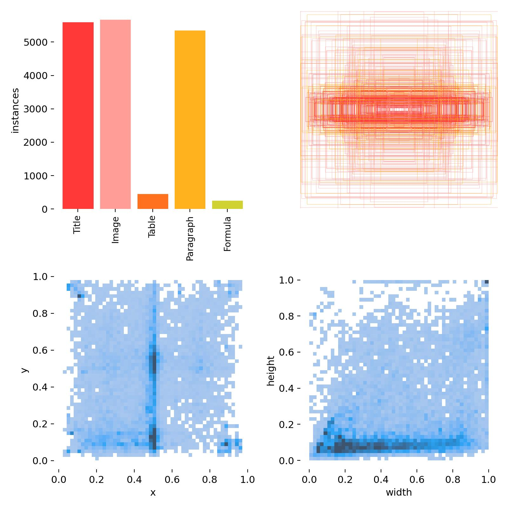

# eye-tracker-ux

## Content

- Datasets: Scripts for web-elements dataset processing.
- Models: YOLOv8 training and validation scripts for web-elements detection.
- Tracking: Scripts for eye-tracking data processing.

## Usage

- Step 1. Get screen markup with YOLO.

```python
from src.models.infer import process_video
preds = process_video(model_path="weights/best.pt", video_path="input.mp4")
```

Output:


- Step 2. Get fixations and saccades from eye-tracker.

See [Demo](notebooks/eye-tracking.ipynb) for more details.

- Step 3. Compare screen markup with fixations and saccades areas.

In progress.

## Training

### YOLOv8

A dataset of 8273 images was used for training.



Experiment is live on comet.com https://www.comet.com/mdvdv/ux/698b9c6b299f4866a24616aa93e2b78d.
See [Training](notebooks/train.ipynb) for more details.

